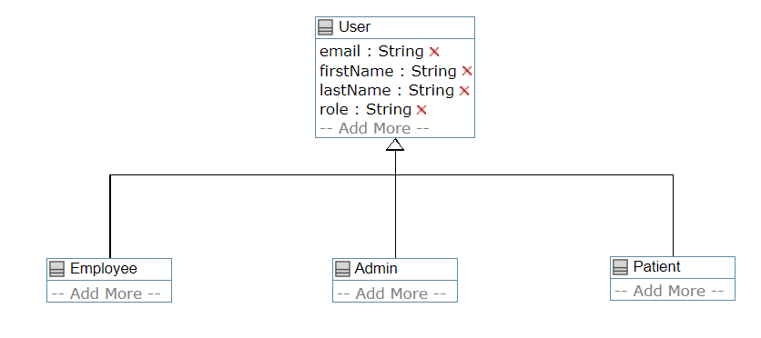
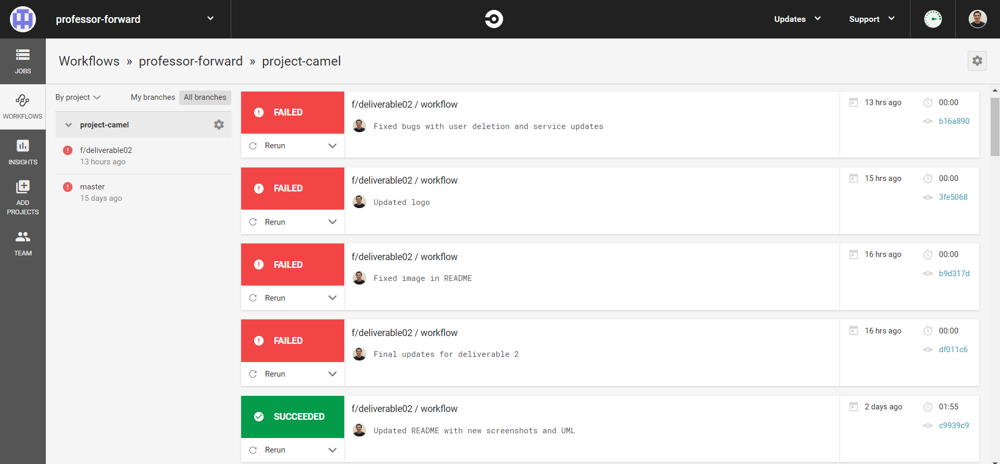
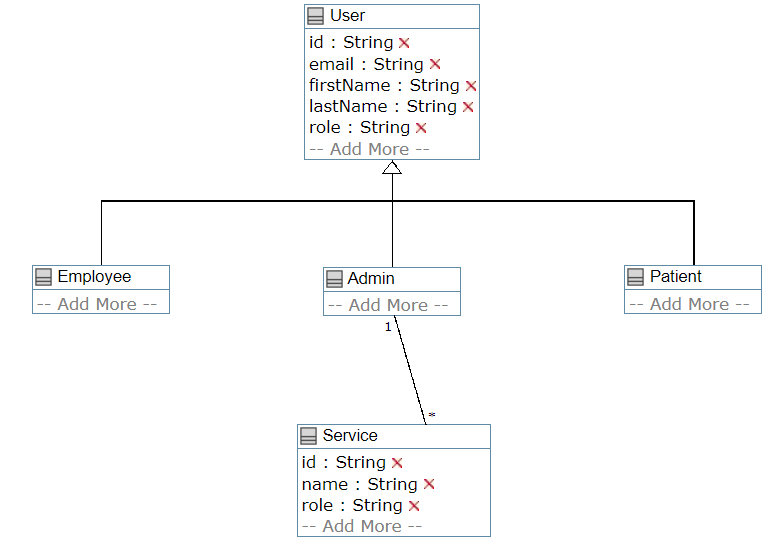
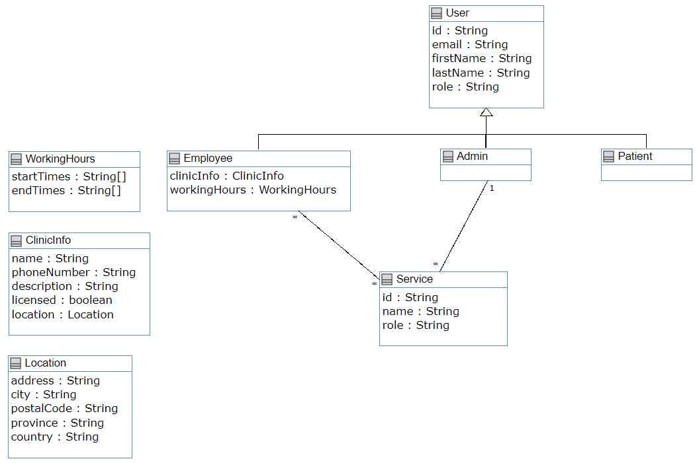
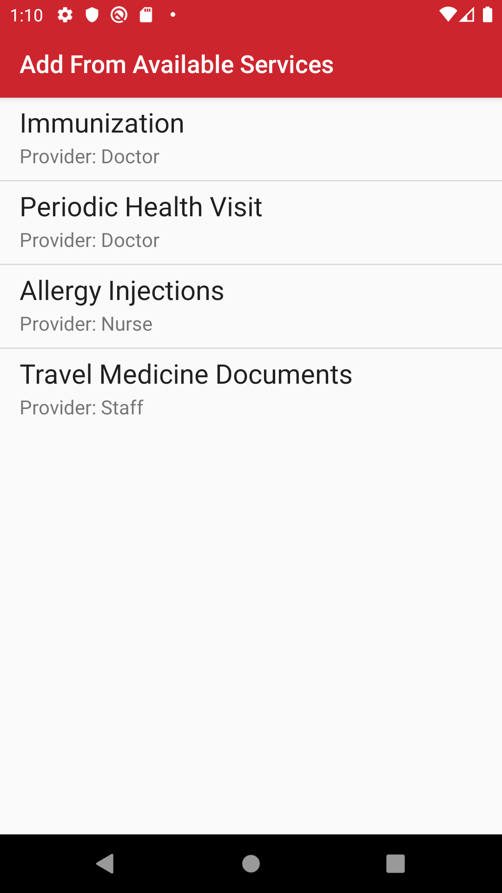
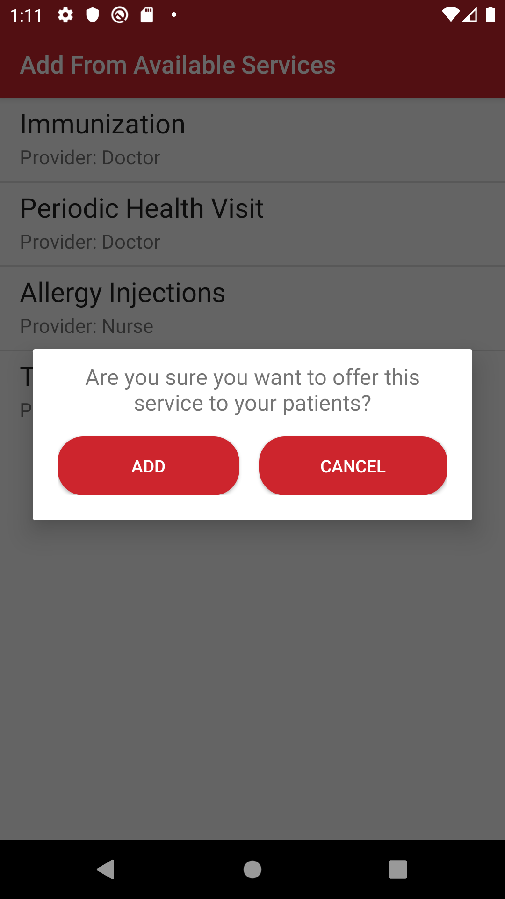

# Clinigo

[](https://circleci.com/gh/professor-forward/project-camel)

Our team developed an app to address the need for people to know wait times at nearby walk-in clinics without having to leave their home. It also allows users to know the services offered by nearby walk-in clinics and allow them to check-in/book appointments at the clinic of their choice. 

We present to you: `Clinigo`

<p align="center">
     
</p>

## Team Members

| Name | Student Number |
| --- | --- |
| Eric Haggar | 7674509 |
| Adel Araji | 7897476 |
| Mark Bastawros | 8123595 |
| Lev Guzman Aparicio   |  300038033 |
| Siraj Ghassel   |  8168653 |

## Table Of Contents

- [Clinigo](#clinigo)
  - [Team Members](#team-members)
  - [Table Of Contents](#table-of-contents)
  - [Deliverable 1](#deliverable-1)
    - [UML Diagram](#uml-diagram)
    - [Activities Screenshots](#activities-screenshots)
  - [Deliverable 2](#deliverable-2)
    - [Admin Account](#admin-account)
    - [Circle CI](#circle-ci)
    - [UML Diagram](#uml-diagram-1)
    - [Activities Screenshots](#activities-screenshots-1)
  - [Deliverable 3](#deliverable-3)
    - [Employee Account](#employee-account)
    - [UML Diagram](#uml-diagram-2)
    - [Activities Screenshots](#activities-screenshots-2)
  - [Deliverable 4](#deliverable-4)
    - [Patient Account](#patient-account)
## Deliverable 1

The first deliverable concentrates on creating accounts and storing them into a database (Firebase).
Only one admin account exists but many patient and employee accounts can be created at will.
Each user has a first name, last name, email and password.

**Please Note:** Emails were used for login to work with Firebase Authentication.

### UML Diagram

The UML diagram for this deliverable is shown below:

<p align="center">
     
</p>

### Activities Screenshots

We took multiple screenshots to demonstrate the different features and their functionality.

1. Home Activity

<p align="center">
     
</p>

2. Sign Up Activities
   
<p align="center">
     
     
</p>

1. Login Activities

<p align="center">
    
     
</p>

4. Admin Example 

<p align="center">
    
</p>

## Deliverable 2

The second deliverable concentrates on the admin features. The admin can create and edit services as well as delete accounts (walk-in clinic employees and patients).

### Admin Account

There is only 1 admin account and the credentials are:

```
Email: admin@admin.com
Password: 5T5ptQ
```

### Circle CI

Circle CI was used to run unit tests. The builds can be found [here](https://circleci.com/gh/professor-forward). The last few builds failed since there are not enough credits for the professor forward account as shown below:

<p align="center">
    
</p>

### UML Diagram

The UML diagram for this deliverable is shown below:

<p align="center">
     
</p>

### Activities Screenshots

1. Admin Homepage 

<p align="center">
     
</p>
    
2. Manage Services Activity

<p align="center">
     
    
     
    </p>

3. Manage Users Activity

<p align="center">
    
     
</p>

## Deliverable 3

The third deliverable implemented the walk in clinic employee related functionality. Employees can create a profile and associate their clinic to the set of predefined and available services (that were created by the admin). The walk in clinic employee can also set the working hours of his clinic.

**Please note**: It is assumed that an employee is responsible for a walk-in clinic. Therefore, an employee account represents a clinic account.

### Employee Account

In order to use an existing employee account, use the following credentials:

```
Email: siraj@ghassel.com
Password: qwe123
```

To create a new employee account, follow the following steps:

1. Navigate to the sign-up page and fill in the information to create an employee account.
2. Log in, and it will prompt to create a clinic profile. All fields must be filled.
3. Upon successful creation of a clinic profile, an employee home page will come up where the employee can navigate to either:

    - Add services to the clinic from the available services
    - Add and update working hours
    - Edit the clinic profile information


### UML Diagram

The UML diagram for this deliverable is shown below:

<p align="center">
     
</p>

### Activities Screenshots

1. Create Clinic Profile

**Please note**: There are no fields for insurance types and payment methods since 
these fields were not mentioned [here](https://github.com/professor-forward/walkinclinic/blob/master/docs/deliverable03.md).

<p align="center">
     
</p>

2. Employee Homepage

<p align="center">
     
</p>

3. Edit Profile Information

<p align="center">
     
</p>

4. Clinic Working Hours

<p align="center">
     
</p>

5. Clinic Services

<p align="center">
    
     
</p>

6. Available Clinic Services To Choose From

<p align="center">
    
     
</p>

## Deliverable 4

The fourth deliverable implemented the patient related functionality. Patients can search for walk-in clinics using different filter types (address, city, working hours and types of services provided). Patients can also view average wait times for each clinic and book/check-in to the clinic of their choice. This feature also includes the ability to check-out (or cancel) once the visit is complete. Finally, a patient can rate a clinic and leave a comment as well as view average ratings for each clinic.

### Patient Account

In order to use an existing patient account, use the following credentials:

```
Email: andrew@forward.com
Password: testing
```

To create a new patient account, follow the following steps:

1. Navigate to the sign-up page and fill in the information to create a patient account.
2. Log in, and patient functionality is available.

All additional information concerning this deliverable can be found in [REPORT](https://github.com/professor-forward/project-camel/blob/master/REPORT.md)


