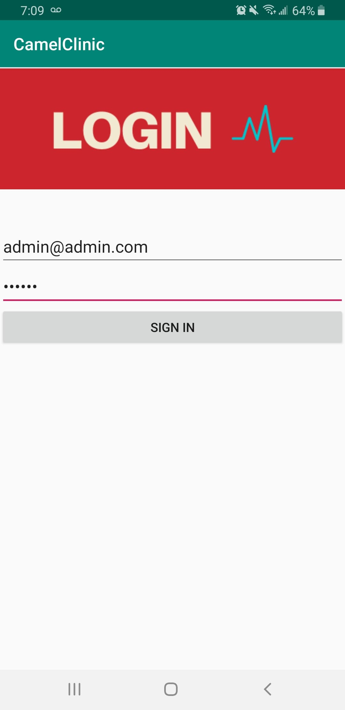
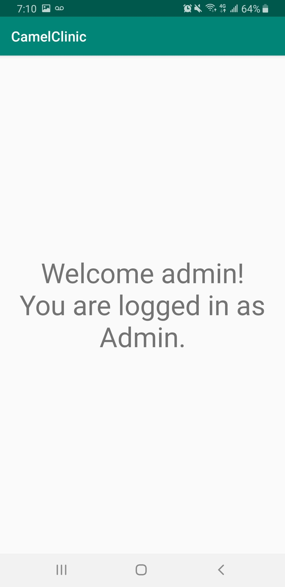

# Project-Camel

## PLEASE NOTE PULL REQUEST ERROR

**The team has made a big mistake and messed up the PR! Please be advised that Professor Andrew Forward gave us permission to merge to master and discard the other branches! Thank you for your understanding**

## Team Members

| Name | Student Number |
| --- | --- |
| Eric Haggar | 7674509 |
| Adel Araji | 7897476 |
| Mark Bastawros | 8123595 |
| Lev Guzman Aparicio   |  300038033 |
| Siraj Ghassel   |  8168653 |

## Deliverable 1

The first deliverable concentrates on creating accounts and storing them into a database (Firebase).
Only one admin account exists but many patient and employee accounts can be created at will.
Each user has a first name, last name, email and password.

**Please Note:** admin@admin.com is the sole admin email since Firebase authentication is used. Firebase requires an email to function. The admin was hardcoded into the Firebase Authentication and Firebase Real-time database.

### UML Diagram

The UML diagram for this deliverable is shown below:

### Activities Screenshots

We took multiple screenshots to demonstrate the different features and their functionality.

1. Home Activity

     

2. Sign Up Activities
   

     
     

1. Login Activities

    
     

4. Admin Example 

    
     

