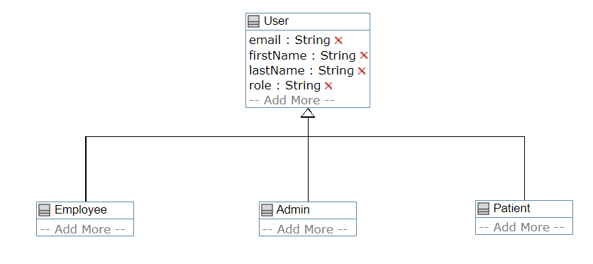
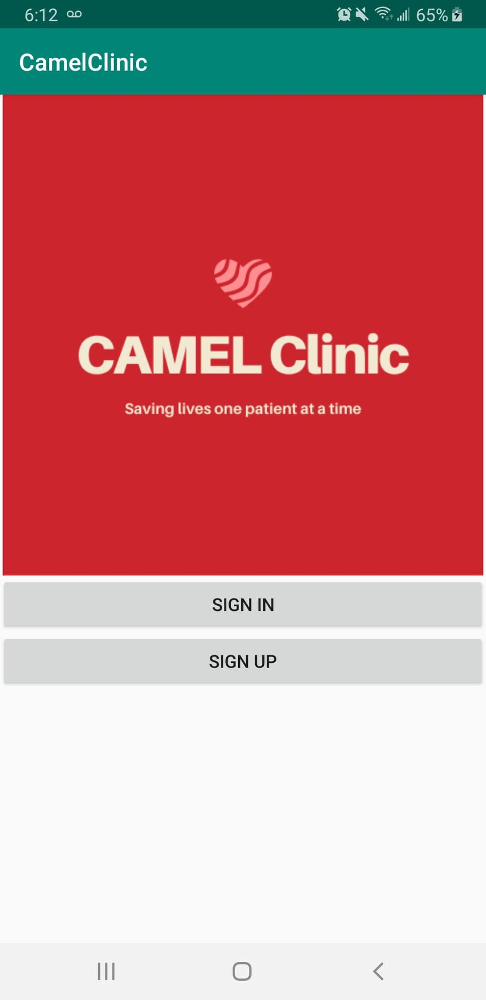
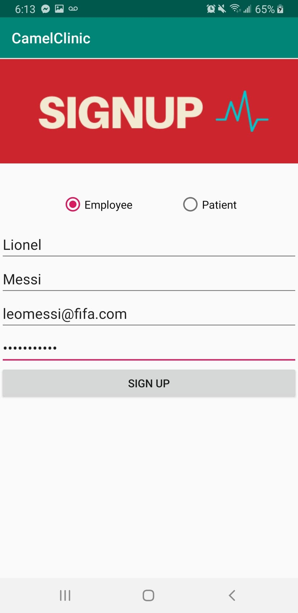
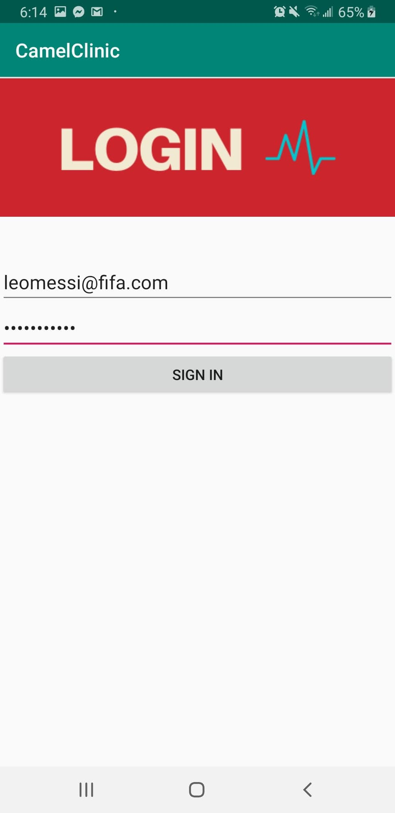
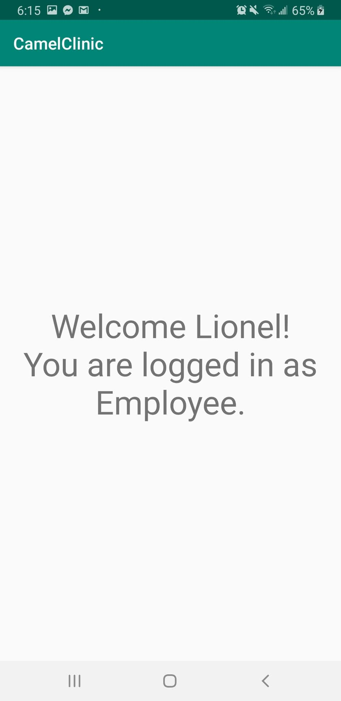

# Camel

## Team Members

| Name | Student Number |
| --- | --- |
| Eric Haggar | 7674509 |
| Adel Araji | 7897476 |
| Mark Bastawros | 8123595 |
| Lev Guzman Aparicio   |  300038033 |
| Siraj Ghassel   |  8168653 |

## Deliverable 1

The first deliverable concentrates on creating accounts and storing them into a database (Firebase).
Only one admin account exists but many patient and employee accounts can be created at will.
Each user has a first name, last name, email and password.

**Please Note:** admin@admin.com is the sole admin email since Firebase authentication is used. Firebase requires an email to function.

### UML Diagram

The UML diagram for this deliverable is shown below:

### Activities Screenshots

We took multiple screenshots to demonstrate the different features and their functionality.

1. Home Activity

     

2. Sign Up Activity
   

     
     

3. Login Activity

    
     

