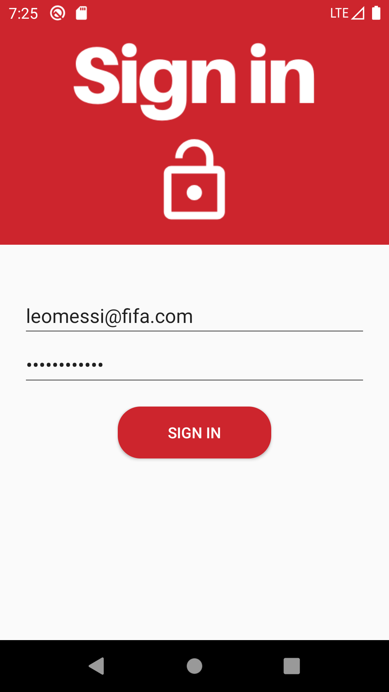

# Project-Camel

Our team developed an app to address the need for people to know waiting times at nearby walk-in clinics without having to leave their home. It also allows users to know the services offered by nearby walk-in clinics and allow them to check-in/book appointments at the clinic of their choice. 

We present to you: `Clinigo`

     

## Team Members

| Name | Student Number |
| --- | --- |
| Eric Haggar | 7674509 |
| Adel Araji | 7897476 |
| Mark Bastawros | 8123595 |
| Lev Guzman Aparicio   |  300038033 |
| Siraj Ghassel   |  8168653 |

## Table Of Contents

- [Project-Camel](#project-camel)
  - [Team Members](#team-members)
  - [Table Of Contents](#table-of-contents)
  - [Deliverable 1](#deliverable-1)
    - [UML Diagram](#uml-diagram)
    - [Activities Screenshots](#activities-screenshots)
  - [Deliverable 2](#deliverable-2)

## Deliverable 1

The first deliverable concentrates on creating accounts and storing them into a database (Firebase).
Only one admin account exists but many patient and employee accounts can be created at will.
Each user has a first name, last name, email and password.

**Please Note:** admin@admin.com is the sole admin email since Firebase authentication is used. Firebase requires an email to function. The admin was hardcoded into the Firebase Authentication and Firebase Real-time database.

### UML Diagram

The UML diagram for this deliverable is shown below:

### Activities Screenshots

We took multiple screenshots to demonstrate the different features and their functionality.

1. Home Activity

     

2. Sign Up Activities
   

     
     

1. Login Activities

    
     

4. Admin Example 

    

## Deliverable 2

The second deliverable concentrates on creating and editing services whilst storing them into a database (Firebase).
Only one admin account exists but many patient and employee accounts can be created and deleted at will.
Each user has a first name, last name, email and password. 
CircleCI was utilized to build and test the app. 

1. Admin Homepage 

2. Manage Service Activities

3. Manage User Activities 
