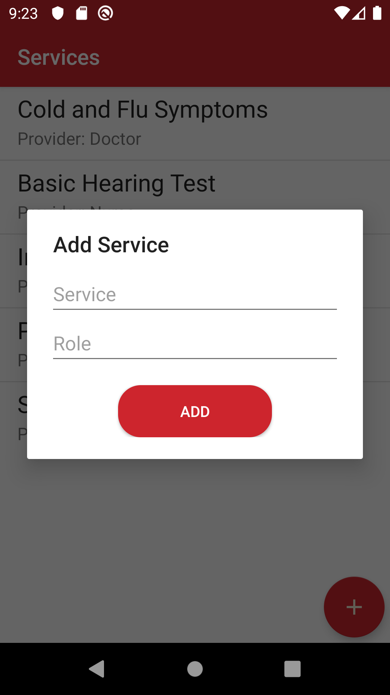
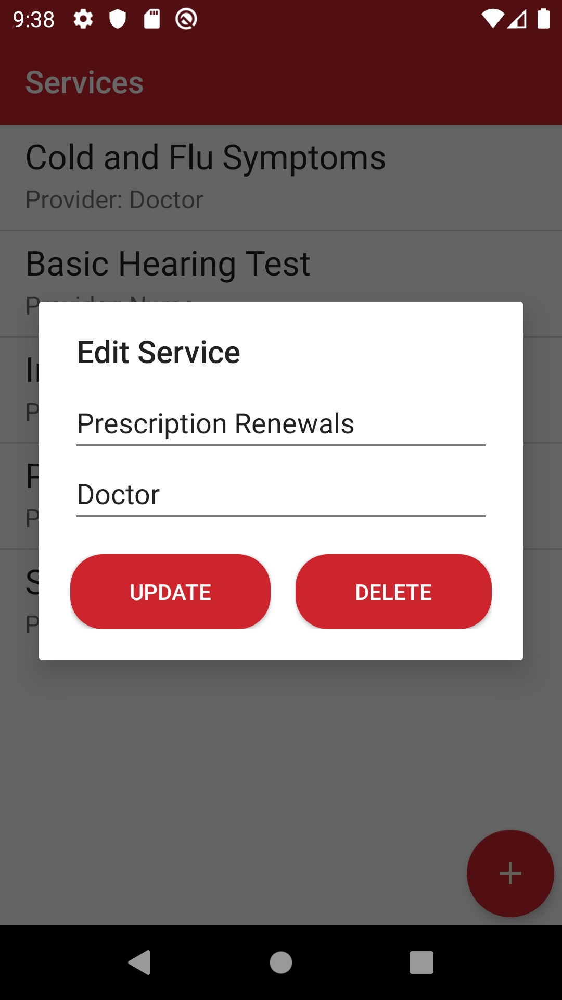

# Clinigo

[](https://circleci.com/gh/professor-forward/project-camel/tree/f%2Fdeliverable03)

Our team developed an app to address the need for people to know wait times at nearby walk-in clinics without having to leave their home. It also allows users to know the services offered by nearby walk-in clinics and allow them to check-in/book appointments at the clinic of their choice. 

We present to you: `Clinigo`

<p align="center">
     
</p>

## Team Members

| Name | Student Number |
| --- | --- |
| Eric Haggar | 7674509 |
| Adel Araji | 7897476 |
| Mark Bastawros | 8123595 |
| Lev Guzman Aparicio   |  300038033 |
| Siraj Ghassel   |  8168653 |

## Table Of Contents

- [Clinigo](#clinigo)
  - [Team Members](#team-members)
  - [Table Of Contents](#table-of-contents)
  - [Deliverable 1](#deliverable-1)
    - [UML Diagram](#uml-diagram)
    - [Activities Screenshots](#activities-screenshots)
  - [Deliverable 2](#deliverable-2)
    - [Admin Account](#admin-account)
    - [Circle CI](#circle-ci)
    - [UML Diagram](#uml-diagram-1)
    - [Activities Screenshots](#activities-screenshots-1)
  - [Deliverable 3](#deliverable-3)

## Deliverable 1

The first deliverable concentrates on creating accounts and storing them into a database (Firebase).
Only one admin account exists but many patient and employee accounts can be created at will.
Each user has a first name, last name, email and password.

**Please Note:** Emails were used for login to work with Firebase Authentication.

### UML Diagram

The UML diagram for this deliverable is shown below:

<p align="center">
     
</p>

### Activities Screenshots

We took multiple screenshots to demonstrate the different features and their functionality.

1. Home Activity

<p align="center">
     
</p>

2. Sign Up Activities
   
<p align="center">
     
     
</p>

1. Login Activities

<p align="center">
    
     
</p>

4. Admin Example 

<p align="center">
    
</p>

## Deliverable 2

The second deliverable concentrates on the admin features. The admin can create and edit services as well as delete accounts (walk-in clinic employees and patients).

### Admin Account

There is only 1 admin account and the credentials are:

```
Email: admin@admin.com
Password: 5T5ptQ
```

### Circle CI

Circle CI was used to run unit tests. The builds can be found [here](https://circleci.com/gh/professor-forward). The last few builds failed since there are not enough credits for the professor forward account as shown below:

<p align="center">
    
</p>

### UML Diagram

The UML diagram for this deliverable is shown below:

<p align="center">
     
</p>

### Activities Screenshots

1. Admin Homepage 

<p align="center">
     
</p>
    
2. Manage Services Activity

<p align="center">
     
    
     
    </p>

3. Manage Users Activity

<p align="center">
    
     
</p>

## Deliverable 3