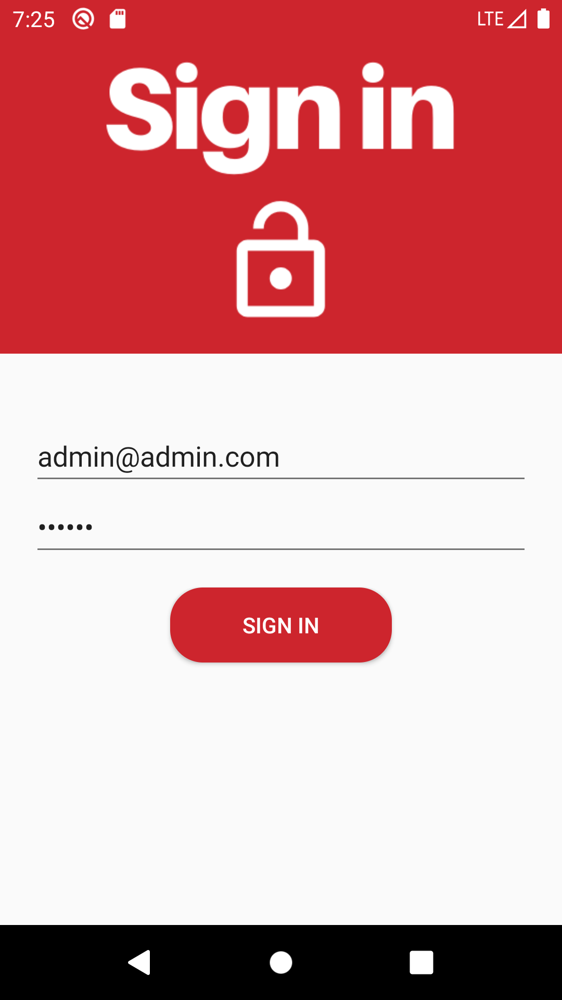

Placeholder for your report to generate in [Deliverable 04](/docs/deliverable04.md)

Refer to [Deliverable 04](/docs/deliverable04.md), but here's some help with markdown.

# An image

Upload SVG (or PNG) files to [/assets](/assets), and then
you can reference them using

# A Table

| Name | Student Number |
| --- | --- |
| Andrew Forward | 1484511
 |
| James Url | 1929204
 |
| Ayana Nurse | 2128439 |

# Introduction

Our team developed an app to address the need for people to know wait times at nearby walk-in clinics without having to leave their home. It also allows users to know the services offered by nearby walk-in clinics and allow them to check-in/book appointments at the clinic of their choice. 

# UML Class Diagram

# Contribution

| Name | Siraj | Eric | Adel | Lev | Marc |
| --- | --- | --- | --- | --- | --- |
| Deliverable 1 | 
 |
| Deliverable 2| 
 |
| Deliverable 3 |  |
| Deliverable 4 |  |

# Screenshots

1. Home Activity

     

2. Sign Up Activities

     

3. Login Activities

    

4. Admin Example 

    

5. Admin Homepage 

     

6. Manage Services Activity

     
    
     

7. Manage Users Activity

    
     

8. Create Clinic Profile

     

9. Employee Homepage

     

10. Edit Profile Information

     

11. Clinic Working Hours

     

12. Clinic Services

    
     

13. 

# Lessons Learned

