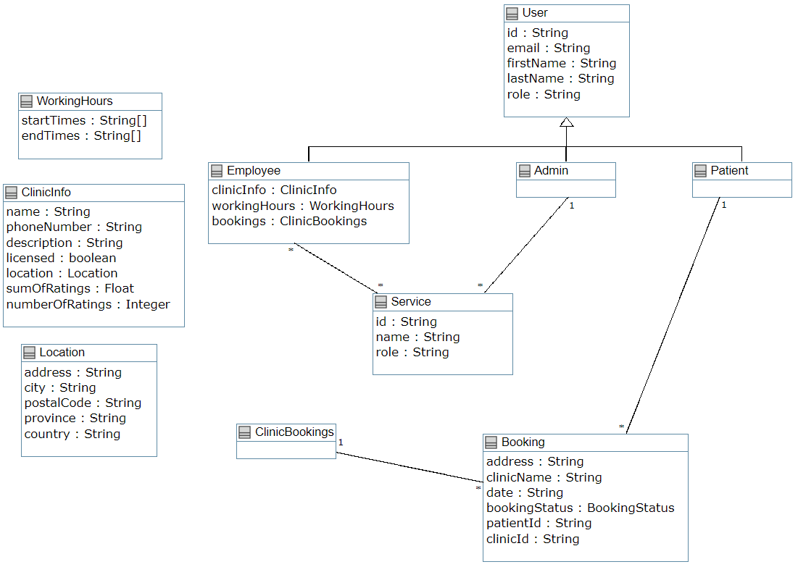
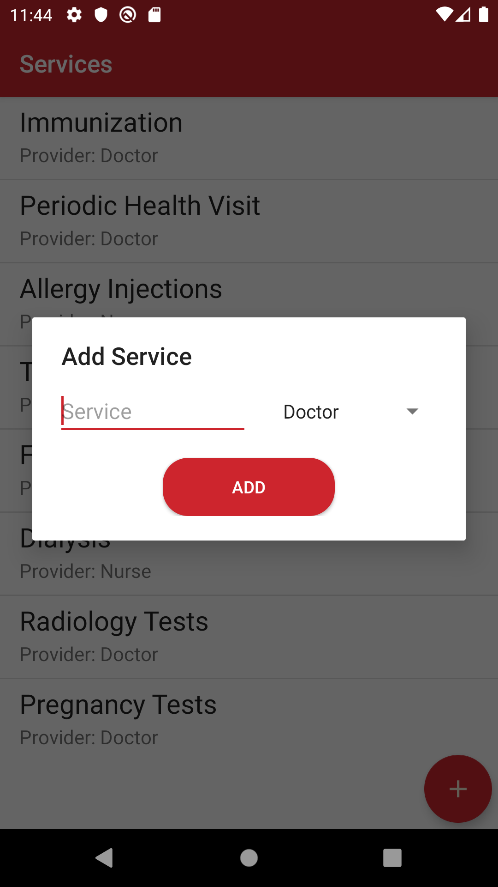
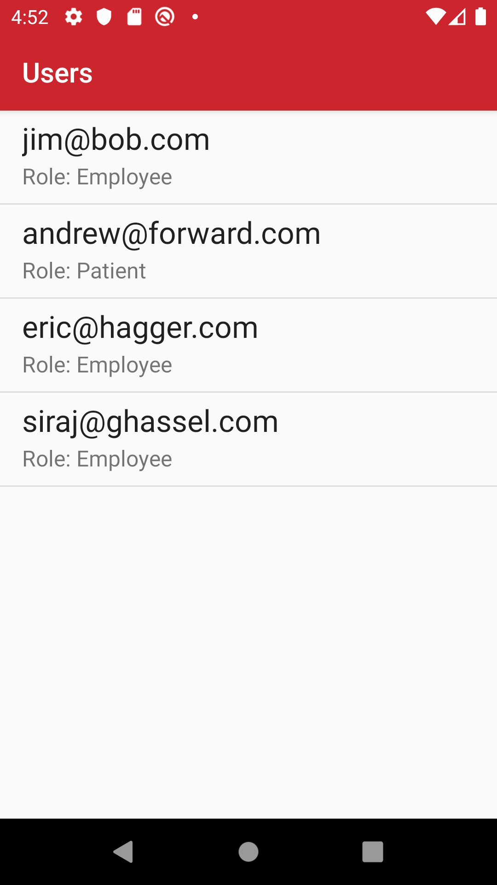
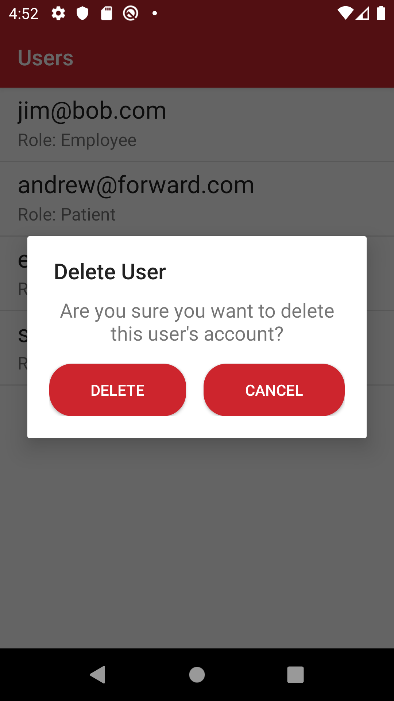
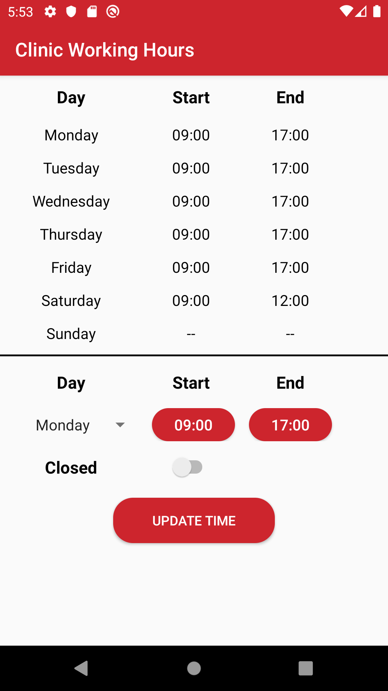
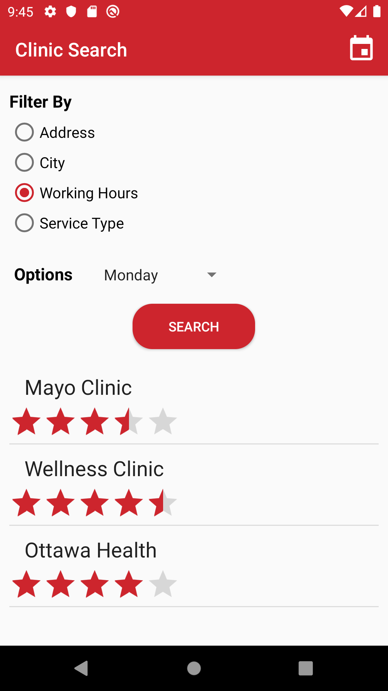
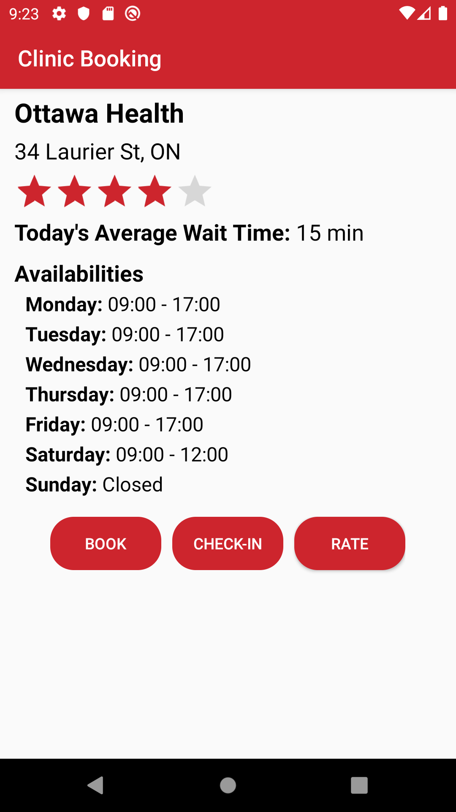
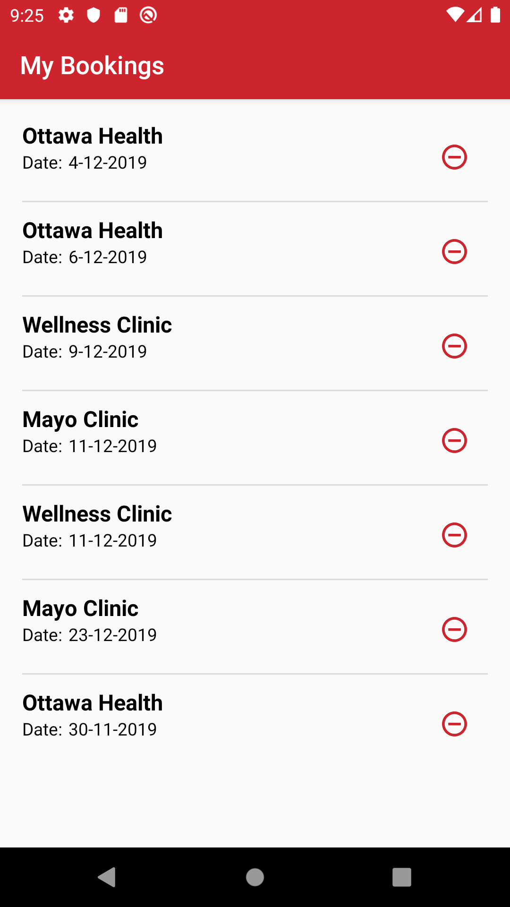

# 
SEG 2105A - Walk in Clinics Services App

     

Presented by: Team Camel

| Name | Role | Student Number | Email |
|:---:|:---:|:---:|:---:|
| Eric Haggar | Team Lead, Developer and UI Designer | 7674509 | ehagg014@uottawa.ca |
| Adel Araji | System Designer and Developer | 7897476 | adel_araji@hotmail.com |
| Mark Bastawros | System Designer and Developer | 8123595 | mbast.amin97@gmail.com |
| Lev Guzman Aparicio | Developer |  300038033 |  lguzm038@uottawa.ca |
| Siraj Ghassel | Developer |  8168653 | sghas058@uottawa.ca |

Professor: Andrew Forward

Department of Electrical Engineering and Computer Science

University of Ottawa

## Table Of Contents
  - [Introduction](#introduction)
  - [UML Class Diagram](#uml-class-diagram)
  - [Task Distribution](#task-distribution)
  - [Screenshots](#screenshots)
  - [Lessons Learned](#lessons-learned)

## Introduction

Our team developed an app called `Clinigo` to address the need for people to know wait times at nearby walk-in clinics without having to leave their home. It allows users to know the services offered by nearby walk-in clinics and allows them to check-in/book appointments at the clinic of their choice. The project was divided into 4 deliverables: Account Creation, Admin Functionality, Employee (Clinic) Functionality and Patient Functionality. 

The first deliverable consisted in developing account creation for employees and patients, while the admin login was harcoded based on the system requirements. Firebase Authentication as well as Firebase Realtime Database were used for authentication and storing new users. 

The second deliverable consisted in allowing the admin to manage users and services. The admin is allowed to delete employee and patient accounts, as well as create, update and delete services that clinics can offer.

The third deliverable consisted in allowing employees to create a profile for their clinic. The clinic therefore has access to add services from the existing services (created by the admin), update their working hours and edit their profile information.

The fourth and final deliverable consisted in allowing patients to search for walk-in clinics, book/check-in to the clinics of their choice and rate clinics from 1 to 5. The patient can search by using different filters: Address, City, Working Hours and Types of Services Provided. The patient can also choose to book a date as an appointment or check-in to the clinic immediately. Before doing so, the patient has access to the current day's average wait-times to make an informed decision. Finally, the patient can remove bookings or check-out from bookings as well as submit a rating and optional comment.

## UML Class Diagram

All important assumptions made throughout the life of this project are presented below:

- An employee account is associated to 1 clinic account (they are the same).
- Bookings are made for a day of the week in a yearly calendar rather than a time of day.
- A patient can only book or check-in to 1 clinic/day.
- A patient can rate a clinic however many times they want, and leaving comments is optional.

The final UML Class Diagram for the project is shown below and can be found on [Umple](https://cruise.eecs.uottawa.ca/umpleonline/umple.php?model=191019783621124).

     

## Task Distribution

The table below shows the general task distribution that was used for each deliverable. However, the team worked closely for each deliverable and some features were implemented/revised by multiple team members. For more details, please see the [projects](https://github.com/professor-forward/project-camel/projects) on Github, where all issues were created, assigned and completed.

| Team Members |      Deliverable 1      |     Deliverable 2     |      Deliverable 3      |           Deliverable 4           |
|:------------:|:-----------------------:|:---------------------:|:-----------------------:|:---------------------------------:|
|     Siraj    |       UML Diagram       |   Admin Manage Users  | Updating Models and UML | Preparing Presentation and Report |
|     Eric     | Firebase Authentication | Circle CI Integration |  Manage Clinic Services |           Rating Clinics          |
|     Adel     |         Sign-up         |     Error Handling    |   Clinic Working Hours  |           Clinic Search           |
|      Lev     |         Sign-in         | Admin Manage Services |        Unit Tests       |      Updating Models and UML      |
|     Marc     |      Model Creation     |       Unit Tests      |    Clinic Information   |      Booking/Check-In Feature     |

## Screenshots

The screenshots for all deliverables are presented in this section.

1. Home Activity

    

2. Sign Up Activities

    

3. Login Activities

    

4. Admin Example

    

5. Admin Homepage

    

6. Manage Services Activity

    
    
    

7. Manage Users Activity

    
    

8. Create Clinic Profile

    

9. Employee Homepage

    

10. Edit Profile Information

    

11. Clinic Working Hours

    

1.  Clinic Services

    
    

13. Clinic Search

    

14. Clinic Booking

    
    
    

## Lessons Learned

All in all, we learned a lot about the fundamentals of building an Android app as well as using version control to work in collaboration. While developing, we learned a lot about how to use adapters and how complex they can become. We also ran into many problems with the asynchronous calls to Firebase and were forced to read more about how to develop around asynchronous functions. Another important technical lesson was to ensure to read the documentation of Android's Lifecycle Activity to truly understand what happens "under the hood". Finally, we learned about how communication and frequent team meetings are very important when developing in collaboration since any misunderstanding can cost a lot of time to fix and debug design code. It's fair to say that all team members enjoyed developing the app and took away valuable lessons that will be useful in future projects.